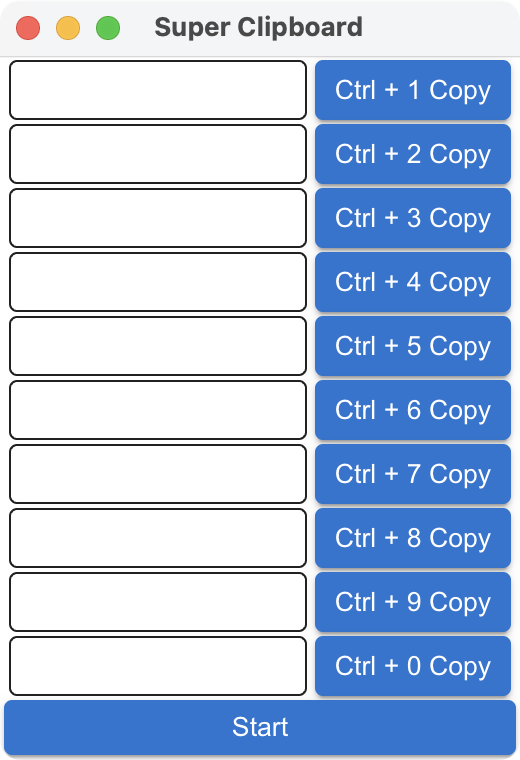
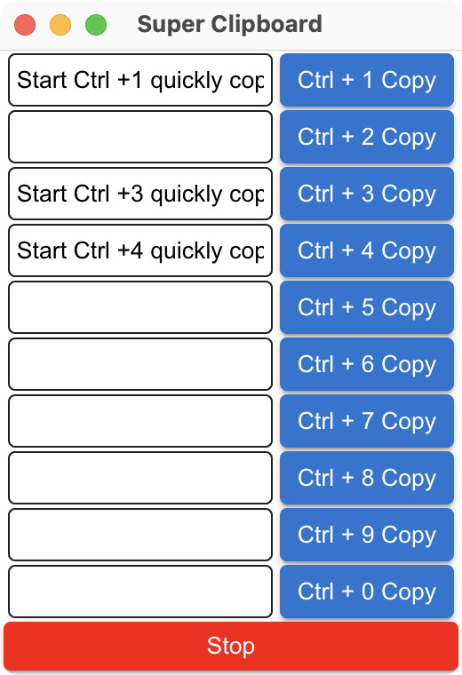

<p>
  SuperClipboard
</p>

## Use electorn internal api to implement global shortcut bindings without using any web tool requests and can review the code
<br>

## Install

Clone the repo and install dependencies:

```bash
git clone --branch main https://github.com/leo-web3/SuperClipboard.git
cd SuperClipboard
npm install

yarn install

pnpm install
```

## Starting Development

Start the app in the `dev` environment:

```bash
npm start

yarn install

pnpm install
```

## Packaging for Production

To package apps for the local platform:

```bash
npm run package

yarn package

pnpm package
```


## open 



## use

